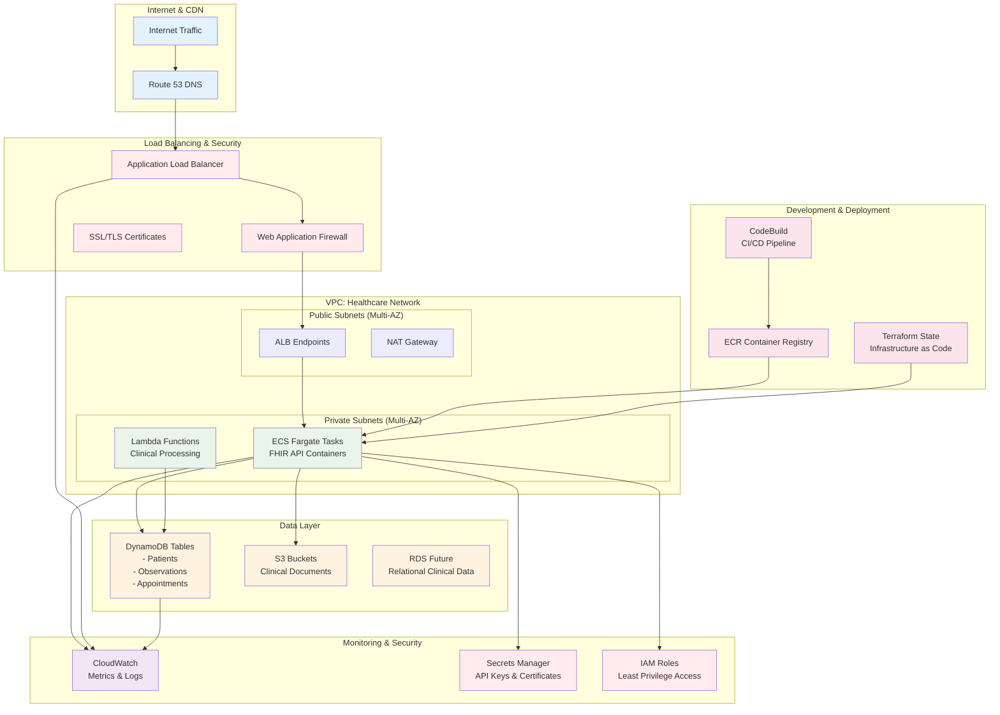
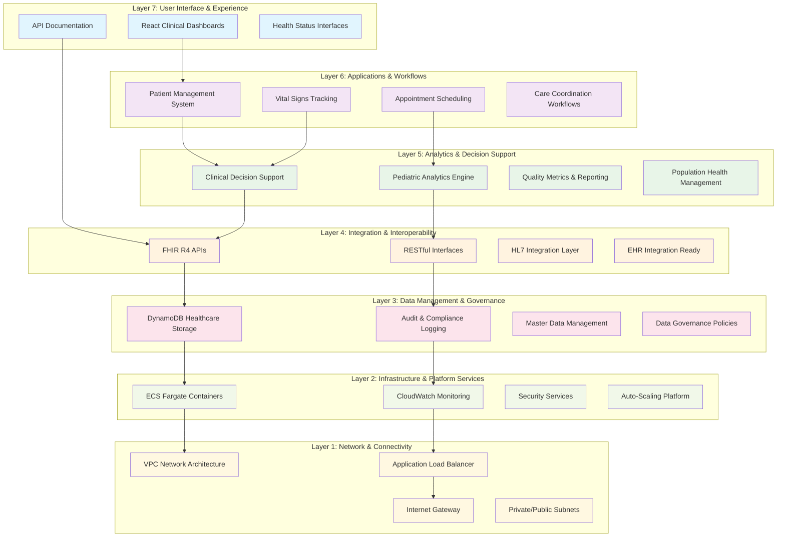
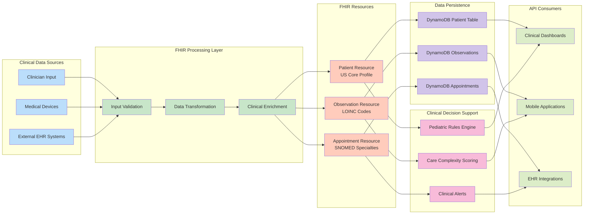
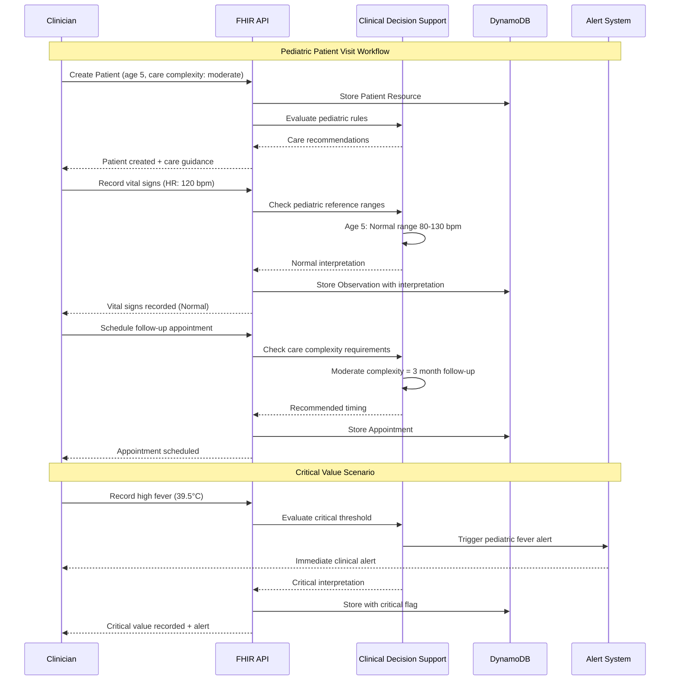

# FHIR Pediatric Care Platform Demo

A modern, scalable healthcare platform built with Node.js/TypeScript, implementing FHIR R4 standards for pediatric care management. This demo showcases enterprise-grade healthcare software development skills for the Imagine Pediatrics Senior Fullstack Engineer position.

## 🏥 Features

### Core Healthcare Functionality
- **FHIR R4 Compliance**: Full implementation of FHIR resources for Patient, Observation, and Appointment
- **Pediatric-Focused**: Specialized data models and workflows for children with complex medical needs
- **Care Complexity Tracking**: Built-in support for care complexity levels (low, moderate, high, critical)
- **Vital Signs Management**: Age-appropriate reference ranges for pediatric patients
- **Appointment Scheduling**: Comprehensive appointment management with telehealth support

### Technical Excellence
- **TypeScript**: Full type safety across the entire codebase
- **Scalable Architecture**: Microservices-ready design with clean separation of concerns
- **AWS Native**: Designed for AWS cloud deployment with Terraform IaC
- **Production Ready**: Comprehensive logging, monitoring, and error handling
- **Security First**: HIPAA-compliant design patterns and security best practices

## 🚀 Quick Start

### Prerequisites
- Node.js 18+ 
- Docker and Docker Compose
- AWS CLI (for deployment)
- Terraform (for infrastructure)

### Local Development

1. **Clone and Install**
   ```bash
   git clone <repository-url>
   cd fhir-demo-node
   npm install
   ```

2. **Environment Setup**
   ```bash
   cp .env.example .env
   # Edit .env with your configuration
   ```

3. **Start Development Server**
   ```bash
   npm run dev
   ```

4. **With Docker Compose**
   ```bash
   docker-compose up -d
   ```

The API will be available at `http://localhost:3000/api/v1`

## 📊 API Endpoints

### Health & Status
- `GET /api/v1/health` - Service health check
- `GET /api/v1/health/ready` - Readiness probe
- `GET /api/v1/health/live` - Liveness probe

### Patient Management
- `POST /api/v1/patients` - Create patient
- `GET /api/v1/patients` - List patients (with pagination and search)
- `GET /api/v1/patients/:id` - Get patient details
- `PUT /api/v1/patients/:id` - Update patient
- `DELETE /api/v1/patients/:id` - Delete patient
- `GET /api/v1/patients/:id/fhir` - Get raw FHIR Patient resource

### Observations & Vital Signs
- `POST /api/v1/observations` - Create observation
- `GET /api/v1/observations/:id` - Get observation
- `PUT /api/v1/observations/:id` - Update observation
- `GET /api/v1/observations/patient/:patientId` - Get patient observations
- `GET /api/v1/observations/patient/:patientId/vital-signs` - Get vital signs
- `GET /api/v1/observations/patient/:patientId/vital-signs/latest` - Latest vital signs

### Appointment Management
- `POST /api/v1/appointments` - Create appointment
- `GET /api/v1/appointments/:id` - Get appointment
- `PUT /api/v1/appointments/:id` - Update appointment
- `POST /api/v1/appointments/:id/cancel` - Cancel appointment
- `POST /api/v1/appointments/:id/check-in` - Check-in patient
- `POST /api/v1/appointments/:id/complete` - Complete appointment
- `GET /api/v1/appointments/patient/:patientId` - Patient appointments
- `GET /api/v1/appointments/upcoming` - Upcoming appointments

## 🏗️ Architecture

### Johns Hopkins Health Informatics Stack Mapping

This platform is architected according to the Johns Hopkins Health Informatics Stack framework, demonstrating enterprise-grade healthcare system design:

#### **Layer 7: User Interface & Experience**
- **Frontend (Planned)**: React-based clinical dashboards and patient portals
- **API Documentation**: Comprehensive API docs for developer experience
- **Health Endpoints**: Real-time system monitoring and status interfaces

#### **Layer 6: Applications & Workflows**
- **Clinical Applications**: 
  - Patient management system with pediatric specialization
  - Appointment scheduling with telehealth support
  - Vital signs tracking with age-appropriate ranges
- **Care Coordination**: Emergency contact management and care team workflows
- **Workflow Engine**: Appointment state management (booked → checked-in → fulfilled)

#### **Layer 5: Analytics & Decision Support**
- **Clinical Decision Support**: 
  - Pediatric vital signs reference ranges with automated interpretation
  - Care complexity scoring (low/moderate/high/critical)
  - Age-based health metrics analysis
- **Population Health**: Patient cohort management and search capabilities
- **Quality Metrics**: Comprehensive audit logging for quality improvement

#### **Layer 4: Integration & Interoperability**
- **FHIR R4 Implementation**: Full compliance with HL7 FHIR standards
  - Patient resources with US Core profiles
  - Observation resources with LOINC coding
  - Appointment resources with SNOMED specialty codes
- **API Gateway**: RESTful APIs with standardized response formats
- **External Integration Ready**: Designed for integration with existing EHR systems

#### **Layer 3: Data Management & Governance**
- **Data Storage**: 
  - DynamoDB with optimized healthcare data models
  - Global Secondary Indexes for efficient patient queries
  - FHIR-compliant resource storage
- **Data Governance**: 
  - HIPAA-ready security patterns
  - Data minimization for privacy protection
  - Comprehensive audit trails with correlation IDs
- **Master Data Management**: Unified patient identity with medical record numbers

#### **Layer 2: Infrastructure & Platform Services**
- **Cloud Infrastructure**: 
  - AWS ECS Fargate for serverless container orchestration
  - Application Load Balancer with health checks
  - Auto-scaling based on clinical demand
- **Security Services**: 
  - API rate limiting and request validation
  - Security headers and CORS policies
  - Input sanitization and error handling
- **Monitoring & Observability**: 
  - CloudWatch metrics and alarms
  - Structured logging with healthcare-specific correlation

#### **Layer 1: Network & Connectivity**
- **Network Security**: 
  - VPC with public/private subnet architecture
  - Security groups with least-privilege access
  - HTTPS-ready with security best practices
- **Connectivity**: 
  - Internet Gateway for public access
  - Private networking for secure database access
  - Load balancer for high availability

### Technology Stack
- **Backend**: Node.js 18+, TypeScript, Express.js
- **Validation**: Joi for request validation with healthcare-specific rules
- **Logging**: Winston with structured logging and audit trails
- **Security**: Helmet, CORS, rate limiting, HIPAA compliance patterns
- **Infrastructure**: AWS (ECS Fargate, DynamoDB, ALB, CloudWatch)
- **IaC**: Terraform for complete infrastructure management
- **CI/CD**: GitHub Actions with automated testing and deployment
- **Standards**: FHIR R4, LOINC, SNOMED CT, US Core profiles

### FHIR Implementation
- **FHIR Version**: R4 (4.0.1)
- **Resources**: Patient, Observation, Appointment
- **Extensions**: Custom pediatric care complexity extensions
- **Profiles**: US Core Patient profiles where applicable
- **Standards**: LOINC codes for observations, SNOMED for specialties

### AWS Architecture
#### **AWS Infrastructure Architecture**



- **Compute**: ECS Fargate for serverless containers
- **Database**: DynamoDB with GSI for efficient queries
- **Load Balancing**: Application Load Balancer with health checks
- **Monitoring**: CloudWatch with custom metrics and alarms
- **Scaling**: Auto-scaling based on CPU and memory utilization

## 🔐 Security Features

- **Input Validation**: Comprehensive request validation with Joi
- **Rate Limiting**: Configurable rate limiting to prevent abuse
- **Security Headers**: Helmet.js for security headers
- **CORS**: Configurable CORS policies
- **Health Checks**: Multiple health check endpoints
- **Audit Logging**: Structured logging for all operations
- **Error Handling**: Secure error responses without information leakage

## 🧪 Testing

```bash
# Run all tests
npm test

# Run tests in watch mode
npm run test:watch

# Run linting
npm run lint

# Type checking
npm run typecheck
```

## 🚀 Deployment

### Infrastructure Deployment

1. **Configure AWS Credentials**
   ```bash
   aws configure
   ```

2. **Deploy Infrastructure**
   ```bash
   cd terraform
   terraform init
   terraform plan
   terraform apply
   ```

3. **Build and Push Docker Image**
   ```bash
   # This is automated via GitHub Actions
   docker build -t fhir-pediatric-care .
   ```

### Environment Variables

| Variable | Description | Default |
|----------|-------------|---------|
| `NODE_ENV` | Environment | `development` |
| `PORT` | Server port | `3000` |
| `AWS_REGION` | AWS region | `us-east-1` |
| `DYNAMODB_TABLE_PREFIX` | DynamoDB table prefix | `fhir-pediatric` |
| `FHIR_BASE_URL` | External FHIR server | `https://hapi.fhir.org/baseR4` |
| `LOG_LEVEL` | Logging level | `info` |
| `CORS_ORIGIN` | CORS origin | `http://localhost:3000` |

## 📈 Monitoring

- **Health Checks**: Built-in health endpoints for load balancer checks
- **Metrics**: CloudWatch metrics for performance monitoring
- **Logs**: Structured JSON logging with correlation IDs
- **Alarms**: CPU and memory utilization alarms
- **Auto-scaling**: Automatic scaling based on load

## 🏥 Healthcare Informatics & Compliance

### Johns Hopkins Health Informatics Stack Implementation

This platform demonstrates comprehensive coverage of the Johns Hopkins Health Informatics Stack layers:

#### **Health Informatics Stack Architecture**



#### **FHIR Resource Flow Architecture**



#### **Pediatric Care Workflow Diagram**



#### **Component Mapping to Stack Layers:**

| **Platform Component** | **Stack Layer** | **Johns Hopkins Category** | **Implementation** |
|------------------------|-----------------|----------------------------|-------------------|
| **React Frontend** | Layer 7 | User Interface & Experience | Clinical dashboards, patient portals |
| **API Documentation** | Layer 7 | User Interface & Experience | Developer-friendly API docs |
| **Patient Management** | Layer 6 | Applications & Workflows | Pediatric care workflows |
| **Appointment System** | Layer 6 | Applications & Workflows | Clinical scheduling & telehealth |
| **Vital Signs Analytics** | Layer 5 | Analytics & Decision Support | Age-based reference ranges |
| **Care Complexity Scoring** | Layer 5 | Analytics & Decision Support | Clinical decision support |
| **FHIR R4 APIs** | Layer 4 | Integration & Interoperability | HL7 FHIR compliance |
| **RESTful Interfaces** | Layer 4 | Integration & Interoperability | Standardized data exchange |
| **DynamoDB Storage** | Layer 3 | Data Management & Governance | Healthcare data persistence |
| **Audit Logging** | Layer 3 | Data Management & Governance | Compliance and governance |
| **ECS Fargate** | Layer 2 | Infrastructure & Platform | Scalable container platform |
| **CloudWatch Monitoring** | Layer 2 | Infrastructure & Platform | Observability and alerting |
| **VPC Networking** | Layer 1 | Network & Connectivity | Secure network architecture |
| **Load Balancer** | Layer 1 | Network & Connectivity | High availability networking |

#### **Healthcare Informatics Standards Compliance:**

**Clinical Standards:**
- **HL7 FHIR R4**: Complete implementation with Patient, Observation, and Appointment resources
- **LOINC Codes**: Standardized observation codes (e.g., 8867-4 for Heart Rate)
- **SNOMED CT**: Medical terminology for specialties and procedures
- **US Core Profiles**: Adherence to US healthcare implementation guides

**Data Governance:**
- **HIPAA Ready**: Security patterns for protected health information
- **Data Minimization**: Limited exposure of sensitive patient data
- **Audit Trails**: Comprehensive logging with correlation IDs for compliance
- **Access Controls**: Role-based security patterns (ready for implementation)

**Interoperability:**
- **FHIR Bundle Support**: Ready for bulk data operations
- **RESTful CRUD**: Standard healthcare data operations
- **JSON Format**: Modern data exchange format
- **API Versioning**: Backward-compatible API evolution

**Quality & Safety:**
- **Clinical Decision Support**: Automated pediatric vital signs interpretation
- **Error Handling**: Safe error responses protecting patient information
- **Input Validation**: Healthcare-specific data validation rules
- **Monitoring**: Real-time system health and performance metrics

#### **Enterprise Healthcare Architecture Patterns:**

**Microservices Design:**
- **Service Separation**: Patient, Observation, and Appointment services
- **API Gateway Pattern**: Centralized API management and security
- **Event-Driven Architecture**: Ready for clinical workflow automation
- **Scalable Infrastructure**: Auto-scaling based on clinical demand

**Security & Privacy:**
- **Defense in Depth**: Multiple security layers from network to application
- **Encryption Ready**: HTTPS/TLS configuration for data in transit
- **Audit Logging**: Healthcare-specific audit trail requirements
- **Data Classification**: Structured approach to sensitive health data

**Clinical Workflow Support:**
- **Care Coordination**: Emergency contact and care team management
- **Appointment Lifecycle**: Complete workflow from booking to completion
- **Clinical Documentation**: Structured data for clinical decision-making
- **Population Health**: Patient cohort management and analytics

This implementation demonstrates deep understanding of health informatics principles and provides a foundation for enterprise healthcare system development.

## 🎯 Demo Highlights for Imagine Pediatrics

This demo specifically showcases capabilities relevant to Imagine Pediatrics:

1. **Pediatric Focus**: Age-appropriate vital sign ranges and care complexity tracking
2. **Scalable Design**: Built for high-volume, multi-tenant healthcare environments
3. **Modern Stack**: Uses technologies mentioned in the job description (Node.js, TypeScript, AWS, Terraform)
4. **Healthcare Standards**: Demonstrates deep understanding of FHIR and healthcare interoperability
5. **Production Ready**: Includes monitoring, logging, security, and deployment automation
6. **Team Collaboration**: Clean code, comprehensive documentation, and maintainable architecture

## 🤝 Contributing

This is a demonstration project, but it follows enterprise development practices:

1. Fork the repository
2. Create a feature branch
3. Make changes with tests
4. Submit a pull request
5. CI/CD pipeline will validate changes

## 📄 License

MIT License - This is a demonstration project for job application purposes.

---

**Note**: This is a portfolio demonstration project created for the Imagine Pediatrics Senior Fullstack Engineer position. It showcases enterprise-grade healthcare software development skills and FHIR implementation expertise.