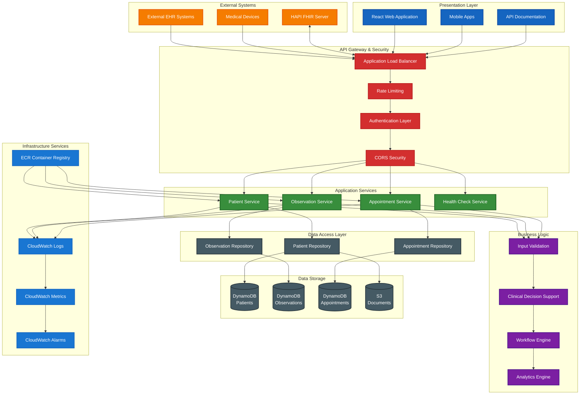
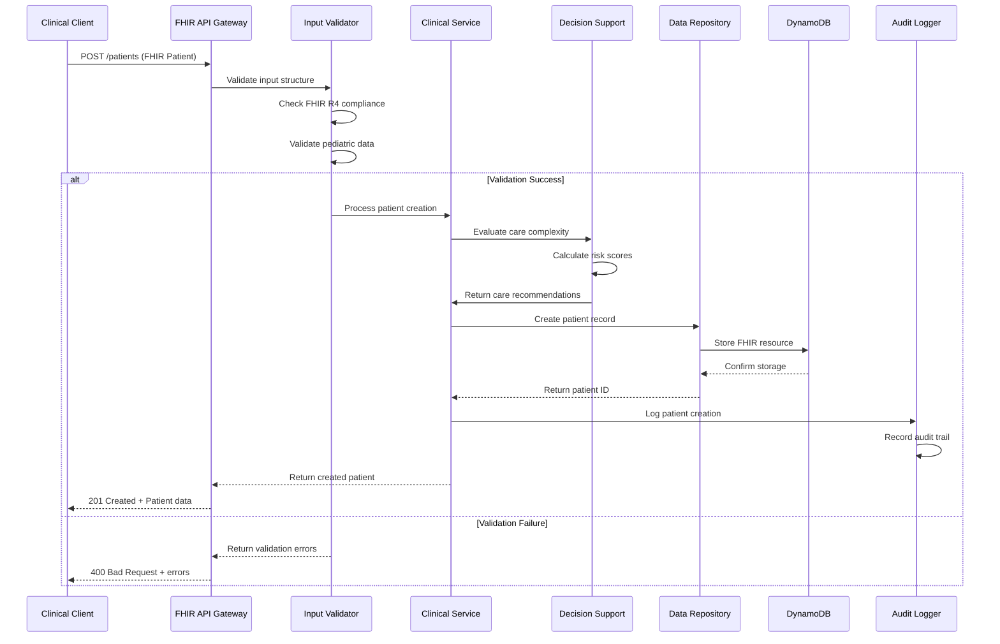
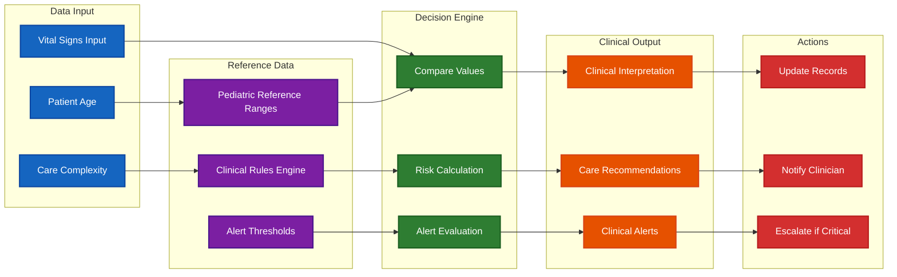
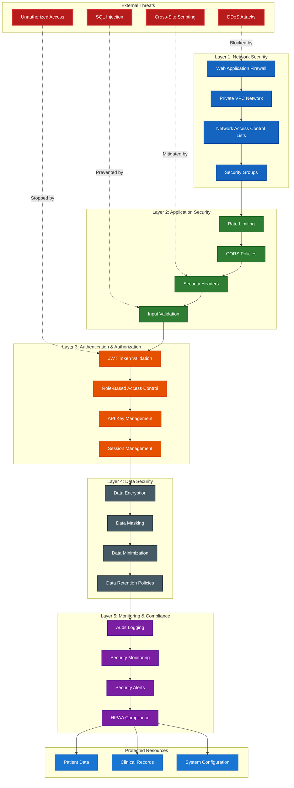

# FHIR Pediatric Care Platform - Architecture Diagrams

This document provides comprehensive visual documentation of the system architecture using Mermaid diagrams.

## System Overview

### Complete System Architecture

## Data Flow Diagrams

### FHIR Resource Creation Flow

### Clinical Decision Support Flow

## Security Architecture

### Security Layers Diagram

## Deployment Architecture

### CI/CD Pipeline

```mermaid
graph LR
    subgraph "Development"
        DEV[Developer]
        GIT[Git Repository]
        PR[Pull Request]
    end
    
    subgraph "CI Pipeline"
        TRIGGER[GitHub Actions Trigger]
        BUILD[Build & Test]
        SECURITY[Security Scan]
        QUALITY[Code Quality]
    end
    
    subgraph "Artifact Management"
        ECR_BUILD[ECR Image Build]
        ECR_PUSH[ECR Image Push]
        TERRAFORM[Terraform Plan]
    end
    
    subgraph "Deployment Stages"
        DEV_DEPLOY[Development Deploy]
        STAGING[Staging Environment]
        PROD_DEPLOY[Production Deploy]
    end
    
    subgraph "Production Infrastructure"
        ECS_UPDATE[ECS Service Update]
        HEALTH_CHECK[Health Checks]
        ROLLBACK[Rollback Capability]
    end
    
    subgraph "Monitoring"
        DEPLOY_METRICS[Deployment Metrics]
        ALERTS_DEPLOY[Deployment Alerts]
        VALIDATION[Post-Deploy Validation]
    end

    %% Development flow
    DEV --> GIT
    GIT --> PR
    PR --> TRIGGER
    
    %% CI pipeline
    TRIGGER --> BUILD
    BUILD --> SECURITY
    SECURITY --> QUALITY
    
    %% Artifact creation
    QUALITY --> ECR_BUILD
    ECR_BUILD --> ECR_PUSH
    QUALITY --> TERRAFORM
    
    %% Deployment stages
    ECR_PUSH --> DEV_DEPLOY
    DEV_DEPLOY --> STAGING
    STAGING --> PROD_DEPLOY
    
    %% Production deployment
    PROD_DEPLOY --> ECS_UPDATE
    ECS_UPDATE --> HEALTH_CHECK
    HEALTH_CHECK --> ROLLBACK
    
    %% Monitoring
    ECS_UPDATE --> DEPLOY_METRICS
    DEPLOY_METRICS --> ALERTS_DEPLOY
    ALERTS_DEPLOY --> VALIDATION
    
    %% Feedback loops
    ROLLBACK -.->|If Failed| STAGING
    VALIDATION -.->|Success| DEV

    %% Styling
    classDef dev fill:#1565C0,stroke:#0D47A1,stroke-width:2px,color:#FFFFFF
    classDef ci fill:#2E7D32,stroke:#1B5E20,stroke-width:2px,color:#FFFFFF
    classDef artifact fill:#E65100,stroke:#D84315,stroke-width:2px,color:#FFFFFF
    classDef deploy fill:#7B1FA2,stroke:#4A148C,stroke-width:2px,color:#FFFFFF
    classDef prod fill:#D32F2F,stroke:#B71C1C,stroke-width:2px,color:#FFFFFF
    classDef monitor fill:#455A64,stroke:#263238,stroke-width:2px,color:#FFFFFF

    class DEV,GIT,PR dev
    class TRIGGER,BUILD,SECURITY,QUALITY ci
    class ECR_BUILD,ECR_PUSH,TERRAFORM artifact
    class DEV_DEPLOY,STAGING,PROD_DEPLOY deploy
    class ECS_UPDATE,HEALTH_CHECK,ROLLBACK prod
    class DEPLOY_METRICS,ALERTS_DEPLOY,VALIDATION monitor
```

This comprehensive architectural documentation provides visual representation of all major system components, data flows, security layers, and deployment processes, making it easier for healthcare technology teams to understand and evaluate the platform's design.